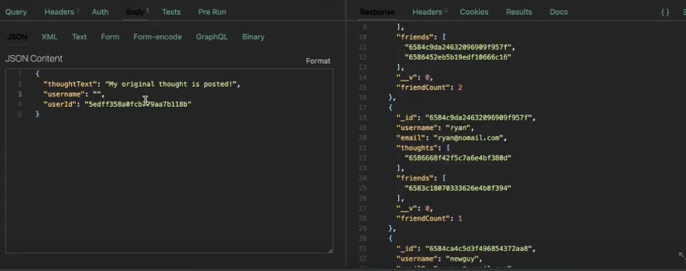

# AirOut

## Description 📰

AirOut is a social media API, which allows users to air out their thoughts, react to other users' thoughts, and add each other as friends, along with updating and delete information.  
The motivation behind this app was to put what I've learned about Mongoose, MongoDB, and NoSQL at large to work. In doing so, I was able to build up routes that create many functionalities we are familiar with when it comes to social media, such as making posts (airing out your thoughts) and making users and adding other users as friends. This solved the previous problem of not knowing how to add friends or reactions via a NoSQL database.  
In learning about NoSQL, we were taught that this is helpful for managing unstructured data in a database. I did not fully know what that entailed until I built this app. This occurred to me when I first tried to delete a thought and noticed that thought IDs were not deleted from a user's data -- this is because that array of thoughts is in the User model, not the Thought model. In contrast to NoSQL, relational databses such as MYSQL would have automatically removed that data because these models would have been associated with each other. In learning this, I happily thought up creative solutions to still achieve the same coordinated end result. That was just one example. Please feel free to test the app yourself or watch the video in the Usage section to see the results!

## Table of Contents

&nbsp;&nbsp;&nbsp;&nbsp;&nbsp;&nbsp; ➣ [Installation](#Installation)

&nbsp;&nbsp;&nbsp;&nbsp;&nbsp;&nbsp; ➣ [Usage](#Usage)

&nbsp;&nbsp;&nbsp;&nbsp;&nbsp;&nbsp; ➣ [Contributing](#Contributing)

&nbsp;&nbsp;&nbsp;&nbsp;&nbsp;&nbsp; ➣ [Credits](#Credits)

&nbsp;&nbsp;&nbsp;&nbsp;&nbsp;&nbsp; ➣ [Questions](#Questions)

## Installation 🔌

In order to install, please run `npm i`.

## Usage 🧮

In order to use this app, please run `npm start`.

  

### USERS

To retrieve all users or make a user, respectively:  
`GET` `/api/users`  
`POST` `/api/users`

To retrieve, update, or delete a single user, respectively:  
`GET` `/api/users/{userId}`  
`PUT` `/api/users/{userId}`  
`DELETE` `/api/users/{userId}`

In order to add or delete friends, respectively:  
`POST` `/api/users/{userId}/friends/{friendId}`  
`DELETE` `/api/users/{userId}/friends/{friendId}`

### THOUGHTS

To retrieve all thoughts or air out a thought, respectively:  
`GET` `/api/thoughts`  
`POST` `/api/thoughts`

To retrieve, update, or delete a single thought, respectively:  
`GET` `/api/thoughts/{thoughtId}`  
`PUT` `/api/thoughts/{thoughtId}`  
`DELETE` `/api/thoughts/{thoughtId}`

In order to add or delete reactions, respectively:  
`POST` `/api/users/{thoughtId}/reactions`  
`DELETE` `/api/users/{thoughtId}/reactions`

Additionally, you can view the user's friend count and the thought's reaction count in their respective object data.  
A bonus treat is that when a user is deleted, any thoughts they have are also erased.  

Beyond the scope of the intention of this application, I also went ahead and developed the following features:  
- When user adds a friend, they are both added to each other's friends list; conversely, when you delete a friend, both user's arrays are affected.  
- One must be an existing user in order to air out their thoughts.  
- When a thought is deleted, it is also removed from the user's array of thoughts.  
- When a user is totally deleted, they are also removed from other users' friends lists.

Please view the [walkthrough video demonstrating the AirOut app](https://drive.google.com/file/d/1oKWHbxLzSjmTgE5HvxN7JW6xJqaQvQrX/view)!

## Contributing 🍴

In order to contribute, one must fork their repository and create a pull request.

## Credits 🤝

User.js line 17 -  
stackoverflow: https://stackoverflow.com/questions/18022365/mongoose-validate-email-syntax

userController.js -  
lines 78-79: Xpert AI

## Questions 📭

Please enjoy my work at my GitHub, @[mintyry](https://github.com/mintyry).